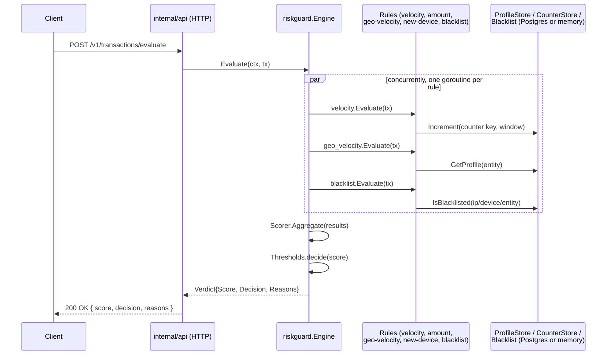
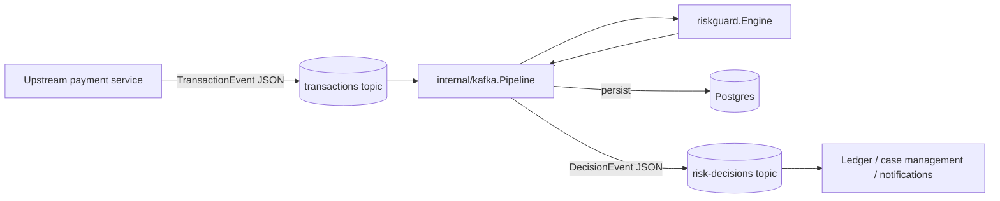

# Architecture

## Goals

`riskguard` is a library first, service second. The core package
(`pkg/riskguard`) has zero dependencies beyond the standard library and no
knowledge of Postgres, Kafka, or HTTP — every integration point is a small
interface (`Rule`, `Scorer`, `CounterStore`, `ProfileStore`, `HistoryStore`,
`Blacklist`). That's a deliberate choice: a fraud/risk engine embedded in a
payment system needs to be testable in isolation, embeddable into an
existing service without dragging in a specific database or message broker,
and safe to run concurrently under real transaction load.

The `cmd/server` binary and `internal/*` packages are one possible
integration — a demo — not the only way to use the library.

## Request flow (synchronous / HTTP demo)



## Event-driven flow (Kafka demo)



This mirrors how a real payment platform would use it: transactions are
published once by whatever system originates them, `riskguard` evaluates and
persists them exactly once via a consumer group, and downstream systems
(case management queues, notification services, the ledger itself) react to
the decision independently, rather than each re-implementing risk checks.

## Why rules run concurrently

Rules are independent, side-effect-free (from the Engine's point of view)
computations that may each involve a store round-trip (a counter increment,
a profile lookup). Running them sequentially means the total latency is the
*sum* of every rule's latency; running them concurrently means it's roughly
the *max*. `Engine.Evaluate` launches one goroutine per rule, collects
results with a `sync.WaitGroup`, and:

- recovers from a panicking rule so one bad rule can't take down evaluation
  for every other rule running alongside it,
- respects a per-evaluation timeout via `context.WithTimeout`, so a stuck
  store call can't hang the whole request indefinitely,
- supports two failure policies (`FailOpen`/`FailClosed`) for what to do
  when a rule can't render a judgment at all — availability-over-strictness
  or strictness-over-availability, depending on what the integration needs.

See `pkg/riskguard/engine.go` and `engine_test.go` for the concurrency
behavior in detail, and `engine_bench_test.go` for a throughput benchmark.

## Storage interfaces

| Interface       | Purpose                                             | Memory impl (tests/demo) | Postgres impl (production-shaped) |
|-----------------|------------------------------------------------------|---------------------------|-------------------------------------|
| `CounterStore`  | Sliding-window event counts (velocity rules)         | mutex + slice of timestamps | `counter_events` table, insert+count+opportunistic cleanup in one transaction |
| `ProfileStore`  | Known devices, last location, running averages       | `sync.RWMutex` + map      | `entity_profiles` + `entity_devices` tables |
| `HistoryStore`  | Recent transactions per entity                        | `sync.RWMutex` + map      | `transactions` table, indexed on `(entity_id, created_at)` |
| `Blacklist`     | IP / device / entity denylist                          | `sync.RWMutex` + set      | `blacklist` table                   |

Swapping the memory implementations for Redis, DynamoDB, or anything else
only requires implementing these four interfaces — the engine and rules
never change.

## Extensibility

Adding a new rule means implementing one method:

```go
type Rule interface {
    Name() string
    Evaluate(ctx context.Context, tx Transaction) (RuleResult, error)
}
```

Adding a new scoring strategy means implementing one method:

```go
type Scorer interface {
    Aggregate(results []RuleResult) float64
}
```

No changes to the engine, the HTTP layer, or the Kafka pipeline are needed
for either.
